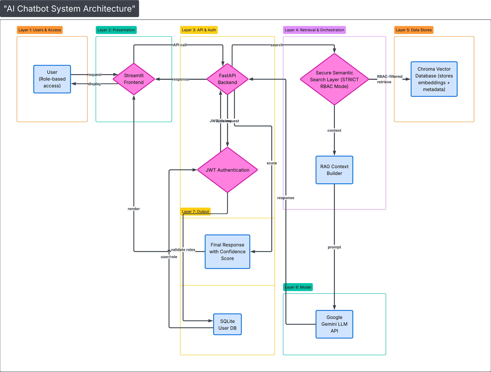

# 🔐 Enterprise Internal AI Assistant with Role-Based Access Control (RBAC)

An enterprise-grade internal AI chatbot designed to securely retrieve and generate department-specific company intelligence using **Retrieval-Augmented Generation (RAG)**, semantic search, and strict **Role-Based Access Control (RBAC)**.

This project was developed as part of the **Infosys Springboard Internship Program**, simulating a real-world enterprise AI knowledge management system.

---

## 📌 Problem Statement

Modern organizations generate large volumes of internal documentation across departments such as **Finance, HR, Engineering, Marketing, and Executive Leadership**. Traditional search systems present several limitations:

- Lack of natural language understanding  
- No role-based document access restrictions  
- No contextual answer generation  
- Absence of source transparency  
- Poor scalability across departments  

As defined in the Infosys Springboard problem statement, the objective is to build:

> A secure, role-aware internal chatbot capable of retrieving and generating responses from company documents using Retrieval-Augmented Generation (RAG), while enforcing strict Role-Based Access Control (RBAC).

### The system must:

- Authenticate users securely  
- Enforce department-based document access  
- Perform semantic retrieval using vector search  
- Generate contextual responses using LLMs  
- Provide transparency through source citations  
- Be fully deployable using free tools  

---

## 🎯 Project Objectives

This implementation achieves the following objectives:

---

### 🔐 Security & Access Control

- JWT-based authentication  
- Strict RBAC enforcement (search-level filtering)  
- Denial of unauthorized document access  
- Role validation at query time  
- Secure API endpoints using FastAPI dependency injection  

---

### 📚 Knowledge Processing

- Parsing Markdown and CSV datasets  
- Recursive document chunking for optimal embedding  
- Metadata enrichment (role, source, content type, document ID)  
- Vector embedding generation using transformer models  

---

### 🧠 AI & Retrieval

- Semantic similarity search using Chroma Vector Database  
- Retrieval-Augmented Generation (RAG) architecture  
- Context construction from top-k retrieved chunks  
- Prompt engineering for structured and executive-style responses  
- Google Gemini integration for fast and structured LLM inference  

---

### 📊 Response Enhancement

- Source citation display for transparency  
- Confidence scoring mechanism based on similarity metrics  
- Response latency measurement (frontend-based timing)  
- Color-coded confidence indicators  
- Clean and interactive chat interface  

---

### 🛠 Reproducibility & Maintainability

- Vector database recreation via `create_db.py`  
- Modular backend architecture  
- Structured folder organization  
- Clear local setup instructions  
- Separation of concerns (Authentication, Retrieval, Generation, UI)  

---

## 🏗 Tech Stack

This project integrates modern backend, AI, and vector search technologies.

---

### 🖥 Backend

#### FastAPI
- High-performance Python web framework  
- Handles authentication and RAG endpoints  
- Implements dependency injection for secure role validation  
- Provides structured API design  

#### JWT (JSON Web Tokens)
- Stateless authentication mechanism  
- Encodes user identity and assigned role  
- Secures protected endpoints  

#### SQLite
- Lightweight relational database  
- Stores user credentials and roles  
- Suitable for local enterprise simulation  

---

### 🧠 AI & NLP Layer

#### Google Gemini 2.5 Flash
- Used for final response generation  
- Selected for:
  - Fast inference speed  
  - Structured response quality  
  - Lightweight API-based integration  
  - Better performance compared to CPU-hosted local LLMs  

#### sentence-transformers/all-MiniLM-L6-v2
- Used for semantic embedding generation  
- Chosen for:
  - Efficient semantic similarity performance  
  - Balanced accuracy and speed  
  - CPU-friendly deployment  

---

### 📦 Vector Database

#### Chroma DB
- Persistent local vector store  
- Stores embeddings along with metadata  
- Supports similarity search with metadata filters  
- Enables strict RBAC enforcement during retrieval  

---

### 🌐 Frontend

#### Streamlit
- Interactive enterprise-style chat interface  
- Displays:
  - Structured AI responses  
  - Source documents  
  - Confidence indicators  
  - Response time metrics  
- Provides clean and intuitive user experience  

---

## 🔄 Architecture Patterns Used

- Retrieval-Augmented Generation (RAG)  
- Strict Role-Based Access Control (RBAC)  
- Persistent Vector Database Architecture  
- Modular Backend Design  
- Separation of Authentication, Retrieval, and Generation Layers  

---

# 🏗 System Architecture

The system follows a modular, layered enterprise architecture that separates authentication, retrieval, and AI generation components. Each layer is responsible for a specific responsibility, ensuring maintainability, scalability, and security.




---


## 🧱 Architectural Layers Overview

The architecture is divided into the following logical layers:

### 1️⃣ User & Access Layer
- Role-based users (Finance, HR, Engineering, Marketing, C-Level, etc.)
- Access restricted based on assigned department role
- JWT token issued after successful authentication

---

### 2️⃣ Presentation Layer
- Built using **Streamlit**
- Provides interactive chat interface
- Sends authenticated requests to backend API
- Displays:
  - Generated answers
  - Source documents
  - Confidence score
  - Response time

---

### 3️⃣ API & Authentication Layer
- Implemented using **FastAPI**
- Handles:
  - User login
  - JWT validation
  - Protected `/rag` endpoint
- Integrates SQLite user database for credential storage
- Injects user role into retrieval pipeline

---

### 4️⃣ Retrieval & Access Control Layer

This is the core security layer of the system.

- Implements **STRICT_RBAC_MODE**
- Performs semantic similarity search
- Filters unauthorized documents before context construction
- Ensures:
  - No cross-department data leakage
  - Search-level enforcement of access control

This layer connects directly to the vector database.

---

### 5️⃣ Vector Database Layer

- **Chroma DB**
- Stores:
  - Embedded document chunks
  - Metadata (role, source, document ID)
- Supports:
  - Top-K similarity retrieval
  - Metadata filtering
  - Persistent storage

---

### 6️⃣ RAG Context Builder

- Combines retrieved chunks into structured context
- Formats prompt using template engineering
- Ensures clean and role-safe context passed to LLM

---

### 7️⃣ AI Generation Layer

- Uses **Google Gemini 2.5 Flash**
- Receives structured context
- Generates:
  - Department-aware responses
  - Executive-style summaries
  - Structured outputs

---

### 8️⃣ Response Layer

Final response returned to frontend includes:

- Generated answer
- Source document references
- Confidence score
- Response time (measured at frontend)

---

## 🔐 Security Characteristics

- Role validation at API level
- Strict RBAC enforcement at retrieval level
- No unauthorized document exposure
- Stateless JWT authentication
- Search-time filtering rather than post-generation filtering

---

## 🧠 Architectural Design Principles

- Separation of concerns
- Modular service structure
- Persistent vector storage
- Secure retrieval-first design
- Enterprise-style layered architecture

---

## 📂 Project Folder Structure

The project follows a modular and enterprise-style backend architecture to ensure separation of concerns, scalability, and maintainability.


```
COMPANY-INTERNAL-CHATBOT/
│
├── api/
│   ├── auth/
│   │   ├── auth_routes.py
│   │   ├── auth_utils.py
│   │   ├── jwt_utils.py
│   │   ├── schemas.py
│   │   └── user_models.py
│   │
│   ├── database.py
│   └── main.py
│
├── document_loader/
│   ├── load_documents.py
│   ├── chunk_documents.py
│   ├── vector_db_utils.py
│   ├── secure_semantic_search.py
│   ├── rbac_utils.py
│   └── role_config.py
│
├── rag/
│   ├── rag_pipeline.py
│   ├── prompt_templates.py
│   ├── gemini_client.py
│   └── confidence.py
│
├── Fintech-data/
│   ├── finance/
│   ├── hr/
│   ├── engineering/
│   ├── marketing/
│   └── general/
│
├── assets/
│   └── system_architecture.png
│
├── chroma_db/              # (Generated locally - not committed)
├── create_db.py            # Script to rebuild vector database
├── streamlit_app.py        # Frontend UI
├── users.db                # SQLite authentication database
├── README.md
└── .env                    # Environment variables (not committed)
```

---

### 🔎 Folder Responsibilities

| Folder | Responsibility |
|--------|----------------|
| `api/` | FastAPI backend, authentication, and protected endpoints |
| `document_loader/` | Document ingestion, chunking, vector storage, RBAC filtering |
| `rag/` | Prompt building, LLM interaction, confidence scoring |
| `Fintech-data/` | Department-specific internal datasets |
| `assets/` | Architecture diagrams and documentation images |
| `create_db.py` | Recreates vector database from source documents |
| `streamlit_app.py` | Interactive enterprise chat interface |

---

### 🏗 Architectural Design Principle

The system is designed with strict separation between:

- Authentication Layer
- Retrieval Layer
- Generation Layer
- Presentation Layer

This ensures:
- Security isolation
- Clean debugging
- Easy scalability
- Future deployment readiness

---

## ⚙️ Local Setup & Installation Guide

Follow the steps below to set up and run the project locally.

---

### 📌 1. Prerequisites

- Python 3.11+
- Git
- Internet connection (for Gemini API access)

---

### 📥 2. Clone the Repository

```bash
git clone <url>
cd COMPANY-INTERNAL-CHATBOT
```

---

### 🐍 3. Create Virtual Environment

```bash
python -m venv venv
```

Activate:

**Windows:**
```bash
venv\Scripts\activate
```

**Mac/Linux:**
```bash
source venv/bin/activate
```

---

### 📦 4. Install Dependencies

```bash
pip install -r requirements.txt
```

---

### 🔑 5. Configure Environment Variables

Create a `.env` file in the root directory:

```
GEMINI_API_KEY=your_google_gemini_api_key
MODEL_TYPE=gemini
```

⚠️ Important:
- Do NOT commit `.env` file to GitHub.
- Obtain API key from Google AI Studio.

---

### 🗂 6. Build Vector Database (One-Time Setup)

Run this only once after cloning:

```bash
python create_db.py
```

This will:
- Load documents
- Chunk them
- Generate embeddings
- Store them in Chroma DB

After this step, `chroma_db/` will contain persisted embeddings.

You do NOT need to run this again unless you modify datasets.

---

### 🚀 7. Start Backend (FastAPI)

```bash
uvicorn api.main:app --reload
```

Backend will run at:
```
http://127.0.0.1:8000/docs
```

---

### 💬 8. Start Frontend (Streamlit)

In a new terminal:

```bash
streamlit run streamlit_app.py
```

Frontend will open in browser.

---

## ✅ System Ready

You can now:

- Login using predefined user credentials
- Query department-specific data
- Test RBAC enforcement
- View confidence scores and sources

---

## 👥 Sample Users & Role Mapping

The system includes predefined users for demonstration purposes.

| Username  | Role        | Password |
|-----------|------------|----------|
| ceo       | C-Level    | 123      |
| finance   | Finance    | 123      |
| hruser    | HR         | 123      |
| engg      | Engineering| 123      |
| marketing | Marketing  | 123      |

⚠️ Note: Passwords are hashed using bcrypt in the SQLite database.

These users are used to demonstrate:

- Strict RBAC enforcement
- Role-based document filtering
- Secure JWT authentication
- Cross-department access restriction testing

---

## 🧪 Demo Queries (Department-wise)

Below are example queries used to validate semantic retrieval, RBAC enforcement, and response generation.

### 🏢 C-Level

- "Summarize the company’s 2024 financial performance."
- "What are the key strategic recommendations for 2025?"

---

### 💰 Finance

- "Explain the impact of vendor costs on net income."
- "What trends are visible in the annual revenue growth?"

---

### 👥 HR

- "Are there any high-salary employees with low performance ratings?"
- "List employees hired after 2021."

---

### 🧑‍💻 Engineering

- "Describe the cloud architecture used by the company."
- "What AWS services are part of the infrastructure?"

---

### 📢 Marketing

- "What are the marketing priorities for 2025?"
- "How is the company optimizing marketing ROI?"

---

