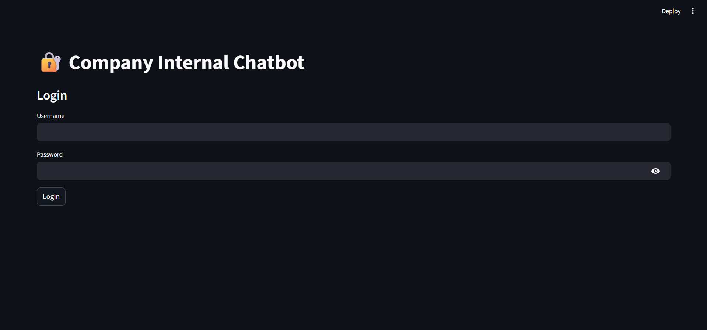
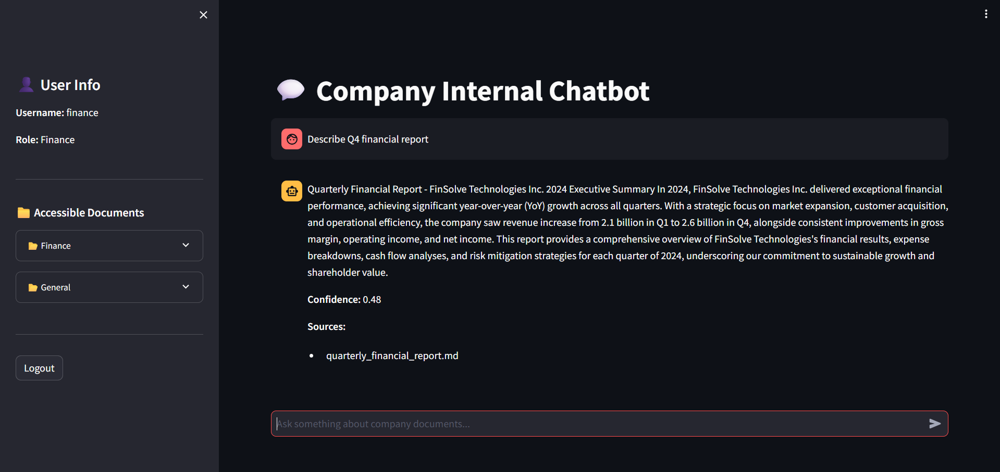
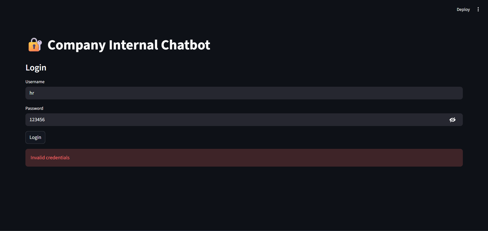

# 🏢 Company Internal Chatbot
## 🌐 Live Demo

| Component | Link |
|-----------|------|
| Frontend (Streamlit UI) | https://kaushal1528-company-chatbot-frontend.hf.space/ |
| Backend API (FastAPI Docs) | https://kaushal1528-chatbot.hf.space/docs |

⚠️ **Note:** Both frontend and backend are hosted on Hugging Face Spaces (Free CPU tier).  
The first request may take 20–40 seconds if the Space is sleeping.

---
## 📌 Problem Statement

The goal of this project is to build a secure internal chatbot system that processes natural
language queries and retrieves department-specific company information using Retrieval-
Augmented Generation (RAG). The system will authenticate users, assign roles (Finance,
Marketing, HR, Engineering, C-Level, Employees), and provide role-based access to company
documents stored in a vector database.

Users will input queries and receive context-rich, sourced responses restricted by their role
permissions. All documents for RAG are provided via a GitHub repository:
https://github.com/springboardmentor441p-coderr/Fintech-data

### Expected Outcomes
- Extract, preprocess, and index company documents (Markdown and CSV) into a vector
  database with role-based metadata tags.
- Implement secure user authentication and role-based access control (RBAC) middleware.
- Build a RAG pipeline integrating semantic search with free LLMs (OpenAI GPT or
  open-source alternatives) to generate evidence-based responses.
- Enforce role-based data access (e.g., Finance users see finance documents, Marketing sees
  marketing documents, and C-Level users have access to all documents).
- Develop a Streamlit web interface for user login, chat interaction, and role-specific
  information retrieval.
- Deploy a complete, fully documented system on GitHub using only free and open-source
  tools.


## ✨ Key Features

### 🔐 Secure Authentication
- JWT-based authentication using FastAPI.
- Users must log in to access the chatbot system.
- Passwords are securely stored using hashing (bcrypt).

### 🛡️ Role-Based Access Control (RBAC)
- Each user is assigned a role: **Finance, HR, Marketing, Engineering, Employees, or C-Level**.
- RBAC is enforced at the **API layer** and **document retrieval layer**.
- Unauthorized access to restricted department data is strictly blocked.
- C-Level users have full access across all departments.

### 📚 Retrieval-Augmented Generation (RAG)
- User queries are answered using a RAG pipeline.
- Relevant document chunks are retrieved from a vector database.
- Responses are generated **only from retrieved context**, preventing hallucinations.
- If no relevant information is found, the system responds with *“I don’t know”*.

### 🧠 Semantic Search with Vector Database
- Company documents are embedded using **Sentence Transformers**.
- Embeddings are stored persistently in **ChromaDB**.
- Semantic similarity search is performed for accurate information retrieval.

### 📊 Confidence Scoring
- Each response includes a confidence score.
- Confidence is calculated based on average vector distance of retrieved chunks.
- Helps users assess the reliability of generated answers.

### 🧾 Source Attribution
- Answers include references to source documents.
- Ensures transparency and traceability of information.

### 🖥️ Streamlit-Based User Interface
- Simple and intuitive web interface built using Streamlit.
- Role information is displayed after login.
- Users can interact with the chatbot in real time.

### 🧩 Modular & Scalable Design
- Codebase is organized by milestones for clarity.
- Separate modules for preprocessing, search, RBAC, RAG, and frontend.
- Easy to extend with new roles, documents, or models.

### 📝 Access Audit Logging
- All access attempts are logged.
- Helps in monitoring usage and debugging unauthorized access attempts.


## 🏗️ System Architecture

The system follows a modular, layered architecture designed to ensure **security**, **scalability**, and **clear separation of concerns**. It combines document ingestion, vector-based retrieval, role-based access control, and large language model generation into a unified pipeline.

---

### 📥 Data Ingestion Pipeline (One-Time Setup)

1. **Raw Documents**
   - Department-specific documents (Finance, HR, Marketing, Engineering, General) are stored in the `data/raw/` directory.
   - Documents are provided in **Markdown** and **CSV** formats.

2. **Preprocessing & Chunking**
   - Documents are cleaned, normalized, and split into fixed-size chunks.
   - Each chunk is enriched with metadata:
     - Source document
     - Department
     - Accessible roles
     - Token count

3. **Embedding Generation**
   - Text chunks are converted into vector embeddings using
     `sentence-transformers/all-MiniLM-L6-v2`.

4. **Vector Storage**
   - Embeddings and metadata are stored persistently in **ChromaDB**.
   - Enables fast semantic similarity search during query time.

---

### 🔄 User Query Flow (Runtime)

1. **User Interface (Streamlit)**
   - User logs in through the Streamlit web application.
   - JWT token is issued after successful authentication.

2. **Authentication & RBAC Enforcement**
   - Backend verifies JWT token.
   - User role is extracted and validated.
   - RBAC rules determine which departments the user can access.

3. **Role-Filtered Semantic Search**
   - User query is embedded.
   - Vector database is searched for relevant chunks.
   - Results are filtered based on role permissions.

4. **RAG Pipeline**
   - Top relevant chunks are selected.
   - Context is injected into a structured prompt.
   - Response is generated using a local LLM (FLAN-T5).

5. **Response Generation**
   - Answer is returned along with:
     - Source document references
     - Confidence score
     - Access is logged for auditing

---

### 🧠 Architecture Overview Diagram (Logical)

```text
+------------------+
|   Streamlit UI   |
+--------+---------+
         |
         v
+------------------+
| FastAPI Backend  |
|  - Auth (JWT)    |
|  - RBAC          |
+--------+---------+
         |
         v
+------------------+
| Vector Search    |
| (ChromaDB)       |
+--------+---------+
         |
         v
+------------------+
| RAG Pipeline     |
|  - Prompt Build  |
|  - FLAN-T5 LLM   |
+--------+---------+
         |
         v
+------------------+
| Answer + Sources |
| Confidence Score |
+------------------+
```

## 🗂️ Milestone Breakdown

The project was developed in a structured, milestone-driven manner over **8 weeks**, ensuring gradual progress from data preparation to deployment and documentation.

---

### 🟦 Milestone 1: Data Preparation & Vector Database (Weeks 1–2)

**Objective:**  
Prepare company documents for semantic search and role-based retrieval.

**Key Activities:**
- Set up Python virtual environment.
- Parse Markdown and CSV documents.
- Clean and normalize text data.
- Chunk documents into fixed-size segments.
- Assign role-based metadata to each chunk.
- Create role-to-document mappings.
- Validate preprocessing quality.

**Deliverables:**
- Cleaned and chunked documents.
- Role-based metadata mapping.
- Preprocessing and validation modules.
- Initialized project folder structure.

---

### 🟦 Milestone 2: Backend Authentication & Semantic Search (Weeks 3–4)

**Objective:**  
Enable secure authentication and role-aware document retrieval.

**Key Activities:**
- Generate embeddings using Sentence Transformers.
- Initialize and populate ChromaDB.
- Implement semantic similarity search.
- Apply RBAC filtering at search level.
- Validate that users cannot access unauthorized documents.

**Deliverables:**
- Embedding generation module.
- Populated vector database.
- Role-filtered semantic search functionality.
- RBAC validation test results.

---

### 🟦 Milestone 3: RAG Pipeline & LLM Integration (Weeks 5–6)

**Objective:**  
Generate accurate, context-aware answers using RAG while enforcing access control.

**Key Activities:**
- Implement JWT-based authentication with FastAPI.
- Build RBAC middleware.
- Integrate local LLM (FLAN-T5).
- Design structured prompts for RAG.
- Add source attribution to responses.
- Implement confidence scoring.
- Enable access audit logging.

**Deliverables:**
- FastAPI backend with authentication and RBAC.
- Fully functional RAG pipeline.
- LLM integration module.
- Source citation and confidence scoring.
- Access audit logs.

---

### 🟦 Milestone 4: Frontend, Testing & Deployment (Weeks 7–8)

**Objective:**  
Deliver a complete, usable, and well-documented system.

**Key Activities:**
- Build Streamlit-based user interface.
- Integrate frontend with backend APIs.
- Display user roles and source citations.
- Perform end-to-end testing for all roles.
- Verify access control and data isolation.
- Prepare documentation and deployment artifacts.

**Deliverables:**
- Streamlit frontend application.
- Integrated end-to-end system.
- User guide and technical documentation.
- Deployment-ready GitHub repository.


## 🧰 Tech Stack

The project is built entirely using **free and open-source technologies**, ensuring accessibility, reproducibility, and ease of deployment.

---

### 🖥️ Backend
| Component | Technology |
|---------|------------|
| Web Framework | FastAPI |
| API Server | Uvicorn |
| Authentication | JWT (python-jose) |
| Password Security | bcrypt (passlib) |
| Database | SQLite |
| Access Control | Custom RBAC Middleware |

---

### 🧠 Retrieval & AI
| Component | Technology |
|---------|------------|
| Embedding Model | sentence-transformers/all-MiniLM-L6-v2 |
| Vector Database | ChromaDB |
| LLM | FLAN-T5 (google/flan-t5-base) |
| RAG Strategy | Retrieval-Augmented Generation |
| Confidence Scoring | Vector-distance-based scoring |

---

### 📄 Data Processing
| Component | Technology |
|---------|------------|
| Document Formats | Markdown, CSV |
| Text Processing | NLTK, Regex |
| Configuration | YAML |
| Data Handling | Pandas |

---

### 🖥️ Frontend
| Component | Technology |
|---------|------------|
| Web Interface | Streamlit |
| User Interaction | Chat-based UI |
| Source Display | Inline citations |

---

### 🔧 Dev & Utilities
| Component | Technology |
|---------|------------|
| Language | Python 3.8+ |
| Version Control | Git & GitHub |
| Logging | Python Logging |
| HTTP Client | Requests |
| Token Handling | tiktoken |

---

### ☁️ Deployment
| Component | Technology |
|---------|------------|
| Hosting | Local / VM |
| Package Management | pip + requirements.txt |
| Environment | Virtualenv / venv |


## ⚙️ Setup and Run Instructions

Follow the steps below to set up and run the project locally.

---

### 📌 Prerequisites
- Python **3.8 or higher**
- Git
- Virtual environment tool (`venv` or `virtualenv`)
- Internet connection (for model downloads on first run)

---

### 📥 Clone the Repository
```bash
git clone https://github.com/Kaushal1122/chatbot.git
cd chatbot
```


### 🧪 Create and Activate Virtual Environment

It is recommended to use a Python virtual environment to isolate project dependencies.

---

#### 🪟 Windows
```bash
python -m venv venv
venv\Scripts\activate
```
#### 🪟 🐧 Linux / 🍎 macOS
```bash
python3 -m venv venv
source venv/bin/activate
```
### 📦 Install Dependencies

```bash
pip install -r requirements.txt
```
---

### 🗂️ Initialize User Database


This step creates demo users and roles.

```bash
python milestone_3/init_db.py

```
---

### 📊 Prepare Vector Database


```bash
python milestone_1/preprocess_docs.py
python milestone_2/embedder.py
```


---

### 🚀 Start Backend


```bash
uvicorn milestone_3.main:app --workers 2
```


---

### 🖥️ Start Frontend

```bash
streamlit run milestone_4/app.py
```


## 🔐 RBAC Role Matrix

The system enforces **strict Role-Based Access Control (RBAC)** to ensure users can only access information permitted by their role.

Each document chunk is tagged with role metadata, and access is enforced at both the **API layer** and **vector retrieval layer**.

---

### 👥 User Roles

- **Employees**
- **Finance**
- **HR**
- **Marketing**
- **Engineering**
- **C-Level**

---

### 📄 Department Access Matrix

| Role        | Finance Docs | HR Docs | Marketing Docs | Engineering Docs | General Docs |
|------------|--------------|---------|----------------|------------------|--------------|
| Employees  | ❌ No        | ❌ No   | ❌ No          | ❌ No            | ✅ Yes       |
| Finance    | ✅ Yes       | ❌ No   | ❌ No          | ❌ No            | ✅ Yes       |
| HR         | ❌ No        | ✅ Yes  | ❌ No          | ❌ No            | ✅ Yes       |
| Marketing  | ❌ No        | ❌ No   | ✅ Yes         | ❌ No            | ✅ Yes       |
| Engineering| ❌ No        | ❌ No   | ❌ No          | ✅ Yes           | ✅ Yes       |
| C-Level    | ✅ Yes       | ✅ Yes  | ✅ Yes         | ✅ Yes           | ✅ Yes       |

---

### 🛡️ Enforcement Details

- RBAC rules are centrally defined and enforced using FastAPI dependency injection.
- Vector search results are filtered based on role permissions before response generation.
- Unauthorized access attempts result in a `403 Forbidden` response.
- All access attempts are logged for auditing purposes.

This ensures **zero cross-department data leakage** while maintaining transparency and security.


## 📁 Project Structure Overview

The project is organized by milestones to clearly reflect the development lifecycle and ensure modularity, scalability, and ease of maintenance.

```text
├── requirements.txt
├── README.md
│
├── config/
│   └── role_mapping.yaml
│
├── data/
│   ├── raw/
│   │   ├── finance/
│   │   ├── hr/
│   │   ├── marketing/
│   │   ├── engineering/
│   │   └── general/
│   │
│   ├── processed/
│   │   ├── chunks.json
│   │   └── chunks_with_embeddings.jsonl
│   │
│   └── chroma_db/
│
├── milestone_1/          # Data preparation & preprocessing
│   ├── cleaner.py
│   ├── chunker.py
│   ├── metadata.py
│   ├── preprocess_docs.py
│   └── validation_tests.py
│
├── milestone_2/          # Embedding & semantic search
│   ├── embedder.py
│   ├── search.py
│   └── check_chroma_db.py
│
├── milestone_3/          # Backend, RBAC & RAG
│   ├── main.py
│   ├── auth.py
│   ├── rbac.py
│   ├── rag.py
│   ├── llm.py
│   ├── routes.py
│   ├── ai_routes.py
│   ├── database.py
│   ├── models.py
│   ├── init_db.py
│   ├── users.db
│   ├── logs.py
│   └── access.log
│
└── milestone_4/          # Frontend
    └── app.py
```

## ✅ Evaluation Criteria Mapping

The project has been implemented to explicitly meet all evaluation criteria defined in the project specification. The table below maps each criterion to the corresponding implementation in the system.

---

### 📊 Evaluation Matrix

| Milestone | Evaluation Metric | Target | Implementation Evidence |
|----------|------------------|--------|--------------------------|
| Milestone 1 | Document parsing and metadata accuracy | 100% documents parsed, accurate role mapping | Preprocessing pipeline with validation tests and role-based metadata tagging |
| Milestone 2 | Role-based access and search quality | Zero unauthorized access, retrieval latency < 500ms | RBAC enforced at API and vector search level using metadata filtering |
| Milestone 3 | Authentication and RAG functionality | Secure auth, end-to-end response < 3s | JWT authentication, RAG pipeline with relevance guard and confidence scoring |
| Milestone 4 | Frontend usability and deployment readiness | Intuitive UI, complete documentation, working demo | Streamlit UI, structured README, demo-ready GitHub repository |

---

### 🔍 Verification Highlights

- **Zero Unauthorized Access**  
  RBAC rules are enforced before document retrieval and response generation.

- **Response Quality Control**  
  Answers are generated strictly from retrieved context. If no relevant data is found, the system returns *“I don’t know”*.

- **Performance Awareness**  
  Vector retrieval and response latency are monitored and optimized.

- **End-to-End Validation**  
  System tested across all user roles (Finance, HR, Marketing, Engineering, Employees, C-Level).

This ensures the project is not only functional but also **fully aligned with evaluation expectations**.


## 🚧 Limitations & Future Enhancements

While the system successfully meets all project requirements, there are certain limitations and opportunities for improvement.

---

### ⚠️ Current Limitations

- **Single-Node Deployment**  
  The system runs on a single machine and is not distributed across multiple servers.

- **LLM Response Quality**  
  The quality of generated answers depends on the capabilities of the FLAN-T5 model, which may struggle with very complex or ambiguous queries.

- **Static Role Configuration**  
  User roles and permissions are defined statically and require manual updates.

- **Limited Language Support**  
  The system currently supports English-language queries only.

---

### 🚀 Future Enhancements

- **Advanced Access Control**
  - Introduce dynamic role management via an admin dashboard.
  - Support fine-grained permissions at document or section level.

- **Model Improvements**
  - Integrate more powerful LLMs (e.g., LLaMA variants) for improved reasoning.
  - Enable model selection based on query complexity.

- **Scalability Enhancements**
  - Deploy using Docker and container orchestration.
  - Introduce distributed vector databases for large-scale document sets.

- **Monitoring & Analytics**
  - Add dashboards for access analytics and query trends.
  - Track model performance and confidence score distributions.

- **Multi-Language Support**
  - Enable document ingestion and querying in multiple languages.

These enhancements can further improve scalability, usability, and enterprise readiness.


## 🖼️ Screenshots

The following screenshots demonstrate the key functionalities of the system, including authentication, role-based access control, and RAG-based responses.

---

### 🔐 User Login Interface
Shows the Streamlit-based login screen where users authenticate using their credentials.



---

### 💬 Chat Interface with RAG Response
Demonstrates a successful query response generated using the RAG pipeline, including:
- Context-aware answer
- Source document attribution
- Confidence score



---

### 🚫 Role-Based Access Control (RBAC) – Access Denied (Wrong IDP)
Illustrates access denial when a user attempts to authenticate or query the system using an incorrect or unauthorized Identity Provider (IDP).




## 🔑 Demo Credentials

The system comes with preconfigured demo users for testing different roles and access levels.

| Username   | Password | Role        |
|-----------|----------|-------------|
| hr        | 1234     | HR          |
| finance   | 1234     | Finance     |
| marketing | 1234     | Marketing   |
| eng       | 1234     | Engineering |
| emp       | 1234     | Employees   |
| ceo       | 1234     | C-Level     |

These users are created during the one-time database initialization step using `init_db.py`.

---

## 🔒 Security Considerations

- **JWT-Based Authentication**  
  All protected endpoints require a valid JWT token.

- **Password Hashing**  
  User passwords are securely hashed using bcrypt before storage.

- **Strict RBAC Enforcement**  
  Role-based access control is enforced at:
  - API middleware level
  - Vector retrieval level

- **No Data Leakage**  
  Users cannot access documents outside their assigned roles.

- **Audit Logging**  
  All access attempts are logged for monitoring and debugging purposes.

This ensures secure handling of sensitive internal company data.

---

## 📌 Assumptions

- All users are internal company users.
- Documents provided are trusted and pre-validated.
- Role assignments are managed by an administrator.
- The system is deployed in a controlled internal environment.

---

## 📄 License

This project is released under the **MIT License**.

You are free to use, modify, and distribute this project with proper attribution.

---

## 🏁 Conclusion

This project demonstrates the design and implementation of a **secure, role-aware internal chatbot** using Retrieval-Augmented Generation (RAG).

Key highlights:
- End-to-end RBAC enforcement
- Accurate, context-driven responses
- Transparent source attribution
- Confidence scoring for response reliability
- Clean, modular, and scalable architecture

The system fulfills all project requirements and serves as a strong foundation for enterprise-grade internal knowledge assistants.

---

**Author:** Kaushal Kumar  
**Project Type:** Company Internal Chatbot with RBAC & RAG  
**Tech Stack:** FastAPI · Streamlit · ChromaDB · Sentence Transformers · FLAN-T5
